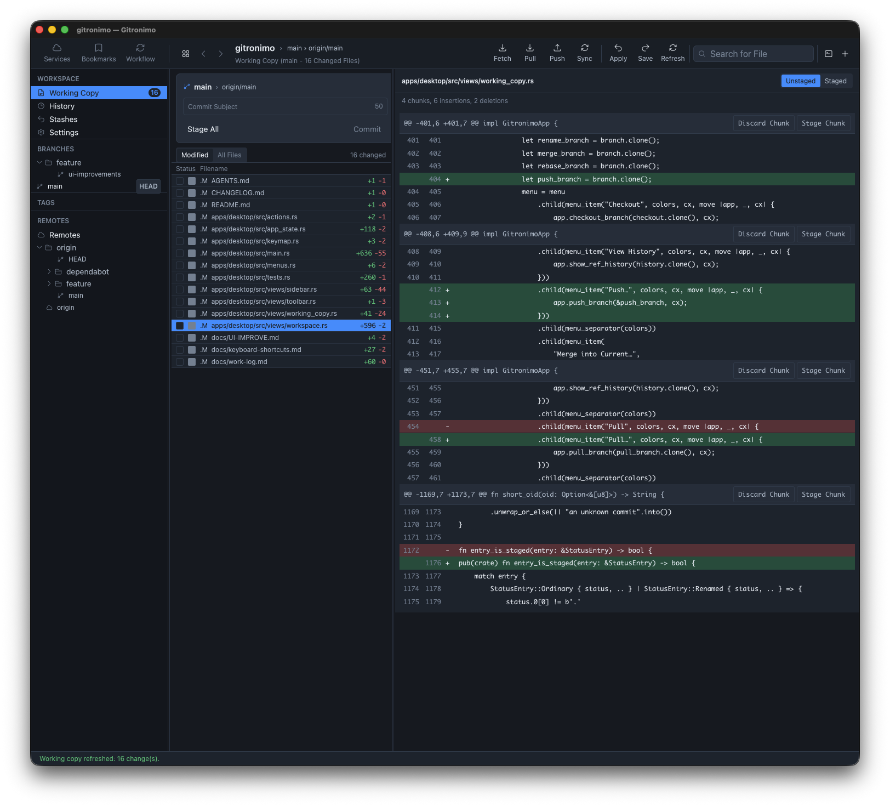

# GitRonimo

<p align="center">
  
</p>

GitRonimo is a native macOS Git client written in Rust with [GPUI](https://gpui.rs). It keeps Git as the source of truth. The default engine is gitoxide [`gix`](https://github.com/GitoxideLabs/gitoxide) for repository discovery, status, history, stage/commit, and HTTPS fetch/clone. Your installed Git executable remains the fallback (Settings **Use system Git**) and still handles credential helpers, SSH, hooks, signing, filters, LFS, checkout, merge, rebase, stash, and push.

Product version **2.0.0** (About GitRonimo). The Cargo workspace version stays independent; bump the string users see in [`apps/desktop/src/views/about.rs`](apps/desktop/src/views/about.rs) (`APP_VERSION`) after each release.



## 2.0.0 scope

The current release includes:

- **Welcome / Repositories** — open, add, create, and clone local repositories; grouped bookmark folders
- **Working Copy** — status and diffs, Modified/All Files toggle, multi-select (`Command-A`, Shift-click), batch stage/unstage via checkboxes, partial line/hunk staging, commit/amend/sign-off
- **History** — bounded commit log with graph, scope filter, Changeset/Tree detail, double-click to Commit Detail, commit context menu
- **Stashes, Remotes, Pull Requests, Settings** — two-pane list + detail layouts (some secondary views remain palette-only)
- **Workflow** — GitHub Flow / GitLab Flow / git-flow templates, auto-detect, Start / Finish / Sync topic branches (welcome + in-repo)
- **Branches** — context menu (pin/archive/rename/delete…); pinned branches persist and sit at the top of BRANCHES; unmerged delete offers a force-confirm dialog
- **Network** — fetch, pull, publish, and push in the background with cancellation; progress in the activity bar; Pull/Push dialogs for options
- **Command palette / Message history** — searchable scrollable palette (`Command-Shift-P`); activity-bar history of statuses, errors, and confirmations
- **About GitRonimo** — application menu **GitRonimo → About GitRonimo** (icon, version **2.0.0**, “Made in Austin ✩ Texas”, [aomega.co](https://aomega.co), **Check for updates**)
- **Git engine** — default `gix`; Settings **Use system Git** forces the installed executable
- **Git LFS** — Fetch / Pull from the LFS view and palette
- **Stash extras** — file drag onto Working Copy, optional auto-stash, named snapshots
- **In-app updates** — Settings opt-in (off by default); **Check for Updates…** on the GitRonimo menu, About, Settings, and palette. SHA-256 and Gatekeeper before replace. No check on launch
- **AI commit messages** — Settings opt-in; **Suggest** fills the composer from the staged diff and never commits
- **Safety** — typed Git invocation, force-with-lease confirmation, local crash reports, recovery from missing repos and stale index locks

GitHub personal-access-token connect/sign-out lives in **Settings** (not a Services tab).

Not in product: OAuth / enterprise GitHub, VoiceOver roles (GPUI limitation), localization, and a built-in editor. Merge and rebase are available from menus plus continue/abort on Working Copy.

See [PLAN.md](PLAN.md) for the full implementation contract and [CHANGELOG.md](CHANGELOG.md) for release notes.

## Keyboard shortcuts

| Shortcut | Action |
|----------|--------|
| Command-O | Open repository |
| Command-R | Refresh working copy |
| Command-A | Select all visible files (Working Copy) |
| Command-Shift-C | Focus commit subject |
| Command-Shift-S | Save stash |
| Command-Shift-P | Command palette |
| Command-/ | Shortcut reference overlay |
| Command-[ / Command-] | Back / Forward |
| Command-Q | Quit GitRonimo |
| Command-H | Hide GitRonimo |
| Command-F | Focus toolbar search |

Working Copy selection and batch checkbox staging: [`docs/keyboard-shortcuts.md`](docs/keyboard-shortcuts.md).

## Install and run

Download the notarized universal app from [GitHub Releases](https://github.com/mpakus/gitronimo/releases/latest) (Apple Silicon and Intel in one zip). After the `v2.0.0` tag that file is `GitRonimo-v2.0.0.zip`.

To build a local `.app`:

```bash
./bin/build
open target/release-arm/GitRonimo.app   # Apple Silicon
# open target/release-intel/GitRonimo.app  # Intel
```

The menu bar title is **GitRonimo** (binary / bundle name). Gatekeeper will warn on unsigned builds; use the documented signing handoff for a distributable release. An installed Git executable is required.

## Build and verify

```bash
cargo fmt --all -- --check
cargo clippy --workspace --all-targets --all-features -- -D warnings
cargo test --workspace --all-features
cargo deny check
```

## Documentation

| Doc | Description |
|-----|-------------|
| [docs/README.md](docs/README.md) | Documentation index |
| [PLAN-v2](docs/PLAN-v2.md) | Post-1.0 `gix`, updater, LFS/stash, AI commits (A/E/D/G in tree) |
| [v1 todo](docs/todo-v1.md) | Leftover work and doc hygiene toward 1.0 |
| [Architecture](docs/architecture.md) | Crate layers and mutation flow |
| [Keyboard shortcuts](docs/keyboard-shortcuts.md) | Global and Working Copy shortcuts |
| [Desktop shell](docs/desktop-shell.md) | Activity bar, palette, confirms, pins, About |
| [UI plan](docs/UI-PLAN.md) | UI phases |
| [UI improve](docs/UI-IMPROVE.md) | View patterns and remaining UI gaps |
| [Work log](docs/work-log.md) | Implementation notes |
| [Troubleshooting](docs/troubleshooting.md) | Recovery and toolchain |
| [Packaging](docs/packaging.md) | Apple Silicon / Intel bundles, signing |
| [Contributing](CONTRIBUTING.md) | Development rules |
| [AGENTS.md](AGENTS.md) | Agent/coding constraints |

## Architecture and support

- [Implementation boundaries](docs/implementation-boundaries.md)
- [Dependency policy](docs/dependency-policy.md)
- [Security policy](SECURITY.md)
- [Third-party notices](docs/third-party-notices.md)
- [Trademark statement](TRADEMARKS.md)

GitRonimo is not affiliated with any other Git client or Git hosting provider. Branding, assets, and copy are original.

## License

Licensed under either of [Apache License, Version 2.0](LICENSE-APACHE) or [MIT license](LICENSE-MIT), at your option.
