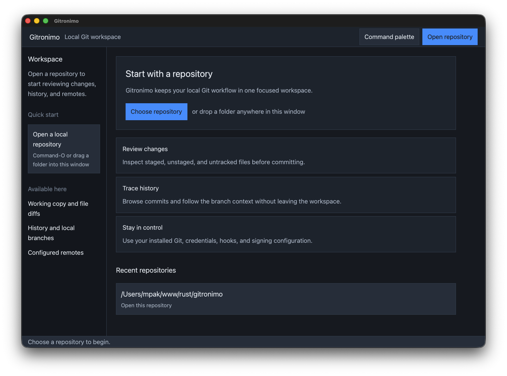

# Gitronimo

Gitronimo is a native macOS Git client written in Rust with GPUI. It keeps Git as the source of truth and uses the installed Git executable for repository operations, credential helpers, SSH, hooks, signing, and filters.



## Beta scope

The current beta can open local repositories, inspect working-copy status and diffs, stage and unstage files, create commits, browse bounded history, manage local branches, and fetch, pull, publish, and push through configured remotes. Network work runs in the background and can be cancelled where Git allows it.

Gitronimo does not yet include partial staging, stash workflows, merge or rebase UI, hosting-service integration, or notarized distribution. See [PLAN.md](PLAN.md) for the implementation contract and known next steps.

## Install and run

Gitronimo currently ships as an unsigned development bundle. On macOS, build and open it with:

```bash
cargo install cargo-packager --version 0.11.8 --locked
cargo packager --release --formats app --manifest-path apps/desktop/Cargo.toml --out-dir target/release
open target/release/Gitronimo.app
```

An installed Git executable is required. See [macOS packaging](docs/packaging.md) for signing and notarization handoff.

## Build and verify

Install Rust 1.97.1, then run:

```bash
cargo fmt --all -- --check
cargo clippy --workspace --all-targets --all-features -- -D warnings
cargo test --workspace --all-features
cargo deny check
```

## Architecture and support

- [Architecture overview](docs/architecture.md)
- [Troubleshooting](docs/troubleshooting.md)
- [Contributing](CONTRIBUTING.md)
- [Security policy](SECURITY.md)
- [Third-party notices](docs/third-party-notices.md)
- [Trademark statement](TRADEMARKS.md)
- [Changelog](CHANGELOG.md)

Gitronimo is not affiliated with Tower or any Git hosting provider. It does not include Tower code, assets, copy, or branding.

## License

Licensed under either of [Apache License, Version 2.0](LICENSE-APACHE) or [MIT license](LICENSE-MIT), at your option.
